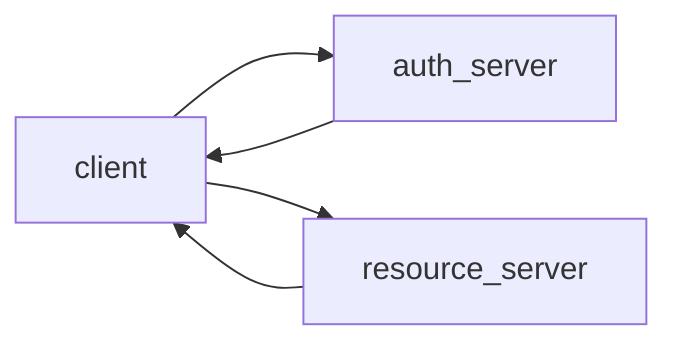
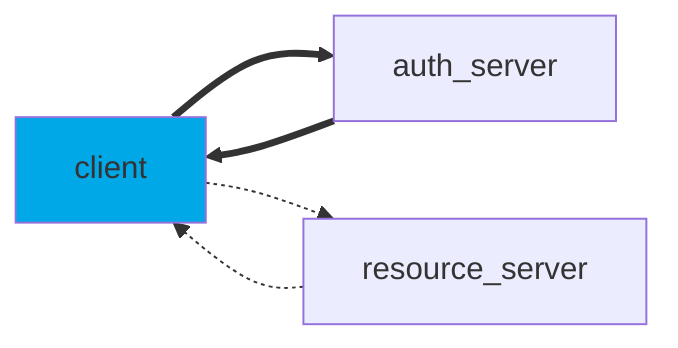
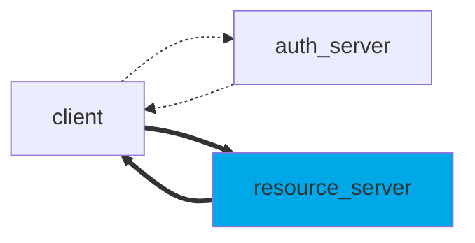

# Basic oAuth2
Oauth2 
This repository provides an abstraction layer to help users in implementing OAuth2 JWT authentication.
Basically, the steps are the following:
1. Client exchanges ID and secret for a JWT access token;
2. Client uses access token to access resource server;
3. Resource server requires JWT and allows operations with valid token only.




## Obtain JWT from Authentication Server

```python
client_id = "add client id here"
client_secret = "add client secret here"
scope = ["add scopes here"]
uri = "add uri here"

my_client = Client(client_id, client_secret, scope, uri)
jwt = my_client.obtain_jwt()
```

## Validate JWT from Resource Server

```python
jwks_uri = "add jwks uri here"
audience = "add audience here"
jwt_validator = JwtValidator(jwks_uri, audience)

jwt = "jwt received by client"
jwt_validator.validate_jwt(jwt)
```