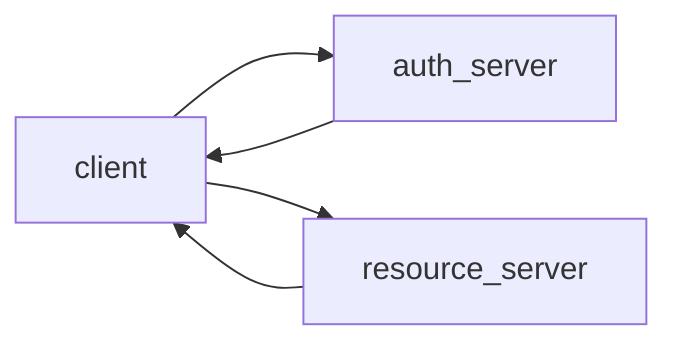
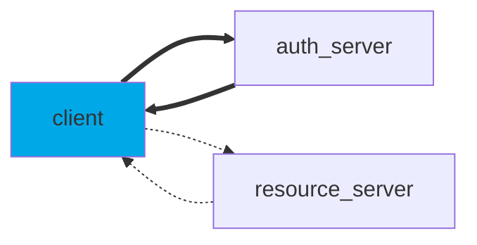
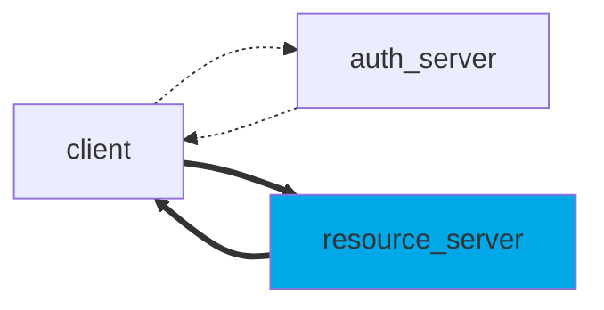

# Basic oAuth2
Oauth2 
This repository provides an abstraction layer to help users in implementing OAuth2 JWT authentication.
Basically, the steps are the following:
1. Client exchanges ID and secret for a JWT access token;
2. Client uses access token to access resource server;
3. Resource server requires JWT and allows operations with valid token only.


## Obtain JWT from Authentication Server

```python
client_id = "add client id here"
client_secret = "add client secret here"
scope = ["add scopes here"]
uri = "add uri here"

my_client = Client(client_id, client_secret, scope, uri)
jwt = my_client.obtain_jwt()
```

## Validate JWT from Resource Server

```python
jwks_uri = "add jwks uri here"
audience = "add audience here"
jwt_validator = JwtValidator(jwks_uri, audience)

jwt = "jwt received by client"
jwt_validator.validate_jwt(jwt)
```


# Basic OAuth2

This repository provides an abstraction layer to help users implement OAuth2 JWT authentication. The steps involved in the process are as follows:

1. The client exchanges the ID and secret for a JWT access token.
2. The client uses the access token to access the resource server.
3. The resource server requires a JWT and allows operations only with a valid token.



## Obtain JWT from Authentication Server

To obtain a JWT from the authentication server, follow these steps:

1. Create an instance of the `Client` class with the required parameters:
    ```python
    client_id = "add client id here"
    client_secret = "add client secret here"
    scope = ["add scopes here"]
    uri = "add uri here"

    my_client = Client(client_id, client_secret, scope, uri)
    ```

2. Call the `obtain_jwt()` method on the `my_client` instance to obtain the JWT:
    ```python
    jwt = my_client.obtain_jwt()
    ```

## Validate JWT from Resource Server

To validate a JWT received from the resource server, follow these steps:

1. Create an instance of the `JwtValidator` class with the required parameters:
    ```python
    jwks_uri = "add jwks uri here"
    audience = "add audience here"
    jwt_validator = JwtValidator(jwks_uri, audience)
    ```

2. Call the `validate_jwt()` method on the `jwt_validator` instance, passing the JWT received by the client:
    ```python
    jwt = "jwt received by client"
    jwt_validator.validate_jwt(jwt)
    ```

Remember to replace the placeholder values with the actual values specific to your application.

